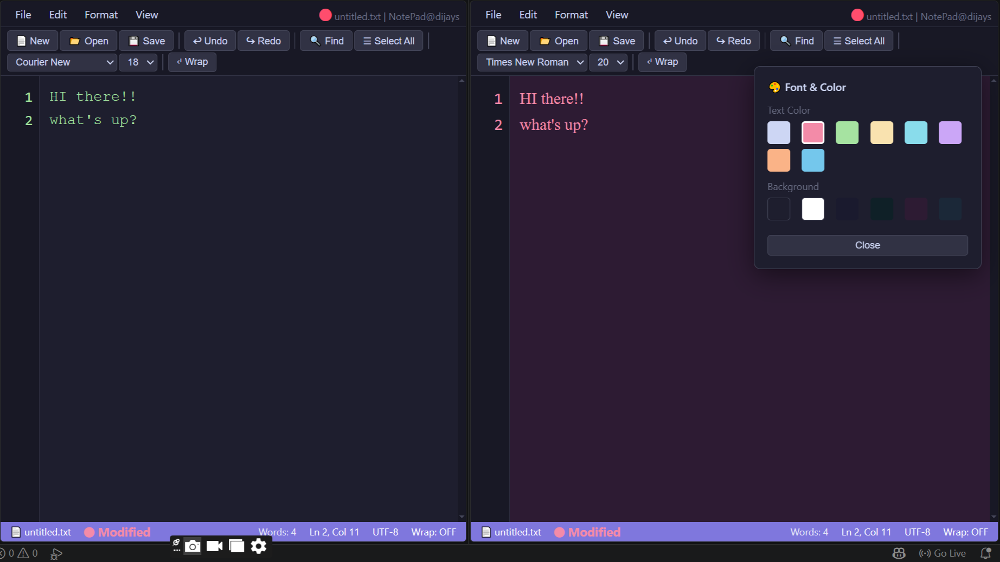

# KadEdit
### A Feature-Rich Text Editor 

A fully functional text editor built in C++ with a beautiful browser-based GUI. The editor demonstrates core data structure concepts including dynamic text storage using `vector<string>`, undo/redo using stack-based history, and recent files management using a custom list — all wrapped in a clean VS Code-inspired interface.

---

## Screenshots

### Web Interface
> 


---
Live demo: 
 https://kamer-stack.github.io/KadEdit/
---

## How to Compile

```bash
g++ -std=c++17 editor_launcher.cpp -o editor.exe
```

## How to Run

```bash
editor.exe
```

The browser opens `editor_ui.html` automatically. The C++ console runs in the background handling file operations.

---

## Example

**Opening the editor:**
```
=== Text Editor - Q2 ===
Opening editor UI in browser...
Editor opened in browser!
```

**Console file operation:**
```
--- C++ Backend Console ---
Current file: untitled.txt
1. New file
2. Open file
3. Save file
...
Choice: 2
Enter filename: notes.txt
Opened: notes.txt
```

---

## Features

### Part A — File Operations
- Create a new file (`Ctrl+M`)
- Open any file from disk (`Ctrl+O`)
- Save file (`Ctrl+S`)
- Save As with custom filename (`Ctrl+Shift+S`)
- Close file with unsaved changes warning
- Recent files list — remembers last 5 opened files
- Exit with save prompt

### Part B — Editing
- Type text with full keyboard support
- Enter key creates a new paragraph
- Backspace and Delete keys with line merging
- Find & Replace with Find Next, Replace, Replace All
- Change text color from 8 color options
- Change font from 6 font options
- Change font size from 7 size options
- Page Up / Page Down navigation
- Home / End keys
- Select All (`Ctrl+A`)
- Word Wrap toggle
- Zoom In / Out (`Ctrl+` / `Ctrl-`)

### Extras (Unique Features)
- Undo / Redo (`Ctrl+Z` / `Ctrl+Y`) using history stack
- Live word count and line/column display
- Scroll position indicator
- Line numbers panel with scroll sync
- Modified indicator (●) in title bar
- Dark theme VS Code-inspired UI
- Empty find/replace guard — warns before accidental deletion

---

## Keyboard Shortcuts

| Shortcut | Action |
|----------|--------|
| `Ctrl+M` | New file |
| `Ctrl+O` | Open file |
| `Ctrl+S` | Save file |
| `Ctrl+Shift+S` | Save As |
| `Ctrl+F` | Find & Replace |
| `Ctrl+A` | Select All |
| `Ctrl+Z` | Undo |
| `Ctrl+Y` | Redo |
| `Ctrl+W` | Toggle Word Wrap |
| `Ctrl++` | Zoom In |
| `Ctrl+-` | Zoom Out |
| `Ctrl+0` | Reset Zoom |
| `Escape` | Close dialogs |
| `Tab` | Insert 4 spaces |
| `PgUp / PgDn` | Scroll page |
| `Home / End` | Start / End of line |

---

## Data Structures Used

| Structure | Used For |
|-----------|----------|
| `vector<string>` | Storing text lines in memory |
| `vector<vector<string>>` | Undo/Redo history stack |
| `vector<string>` | Recent files list |

---

## File Structure

```          
KadEdit/
├── README.md                  → This file
├── index.html                 → for live website(VS Code dark theme)
└── KadEdit/
    ├── editor_launcher.cpp    → C++ backend, launches GUI, handles file I/O
    ├── editor_ui.html         → Beautiful browser-based GUI (VS Code dark theme)
    └── screenshot/
        └── GUI.png
```

---

## Exit Codes (C++ Backend)

| Code | Meaning |
|------|---------|
| 0 | Normal exit |
| 1 | HTML file not found |

---

## Edge Cases Handled

- Backspace at start of file — does nothing
- Delete at end of last line — does nothing
- Save As with empty filename — cancelled safely
- Find with empty search box — shows error message
- Replace All with empty replace box — asks confirmation before deleting words
- New/Close with unsaved changes — prompts to save first
- Browser tab close with unsaved changes — browser warns before leaving

---

##  Author

**Khadija Amer**  
GitHub: [@kamer-stack](https://github.com/kamer-stack)

---

##  Show Your Support

If you found this project helpful, please give it a ⭐ on GitHub!


<div align="center">


*Built with 💚 | KadEdit | PUCIT*

</div>
